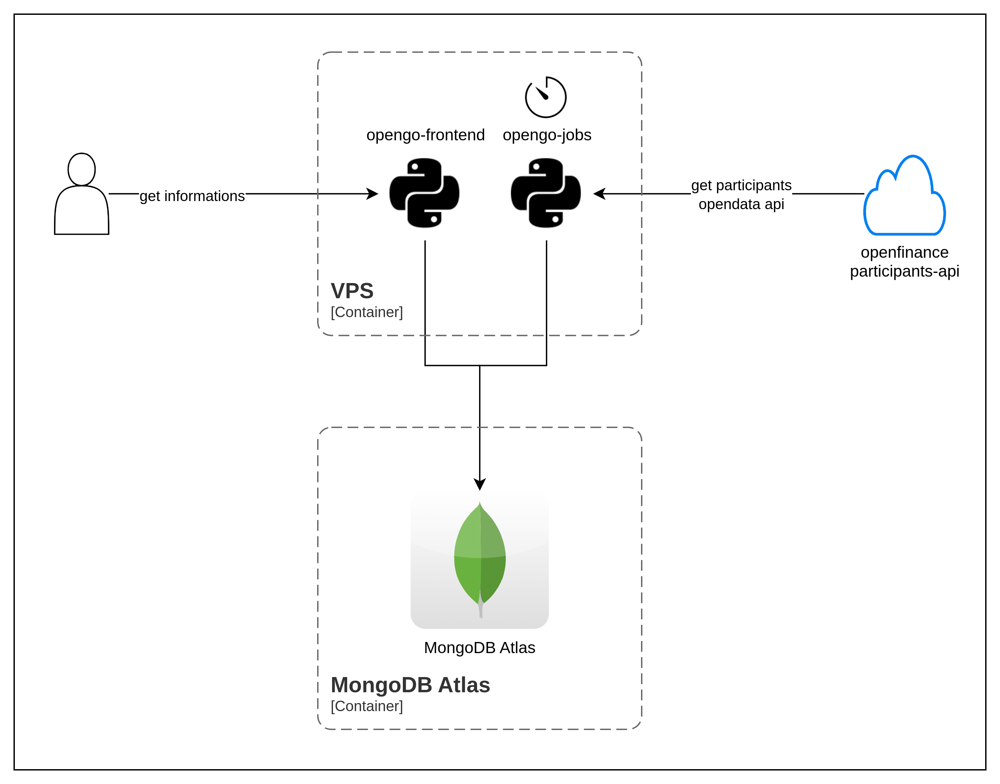

# OpenGo

## Description
OpenGo is a project that uses data from Open Finance Brazil to view and show in a simple way opendata from different financial institutions powered by [Open Finance Brasil](https://openfinancebrasil.org.br/). The project consists of two main components: a data collection script (`opengo_jobs/og_retrieve_apis_job.py`) and a data analysis application (`opengo_analytics/og_analytics.py`).

This project includes the opengo_analytics component.

## Project Structure
- `opengo_analytics/`: Contains scripts for data analysis.
- `Dockerfile`: Docker configuration for the project.
- `pyproject.toml`: Poetry configuration for dependency management.

## Requirements
- Python 3.12
- Poetry

## Installation
1. Clone the repository:
    ```sh
    git clone https://github.com/alexpereiramaranhao/opengo.git
    cd opengo
    ```

2. Install dependencies using Poetry:
    ```sh
    poetry install
    ```

## Usage
### Environment Variables
`MONGO_URI`: MongoDB connection URI.

`DATABASE_NAME`: MongoDB database name.

`ENVIRONMENT`: Environment (e.g., sandbox, production).

### Data Analytics
To run the project script:
```sh
streamlit run opengo_analytics/og_analytics.py
```

### Architecture
</img>

### Contribution
Contributions are welcome! Please open an issue or submit a pull request.

### License
This project is licensed under the GNU GPL v2.0 License.